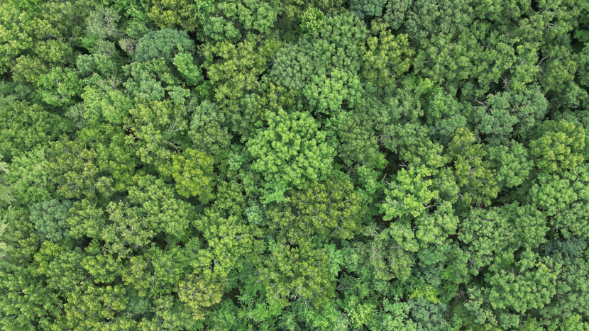

This is the location where I will publish, maintain, and contribute to open-source software.

You can find me in the following locations:
- 
- 

If you'd like to reach out to talk, my interests include the following:
- 3d printing → Both FDM and MSLA
- Video game development → I use [libGDX](https://github.com/libgdx/libgdxgot) and [Godot](https://github.com/godotengine/godot) for my personal projects
- Selfhosting → Mostly home automation with [HomeBridge](https://github.com/homebridge/homebridge)
    
